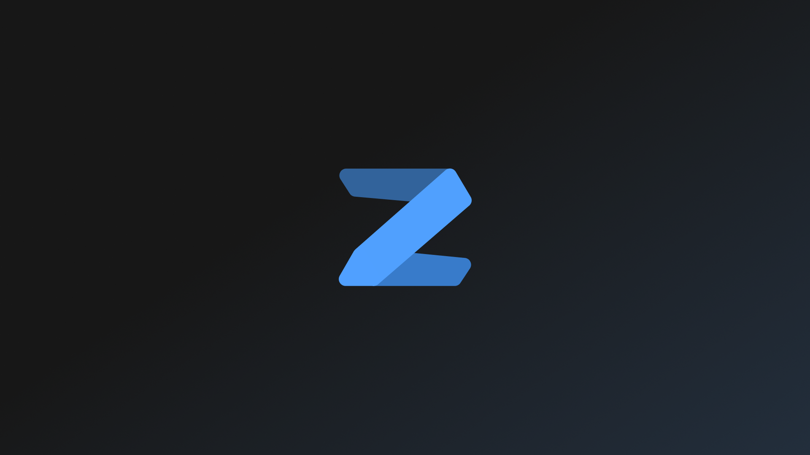
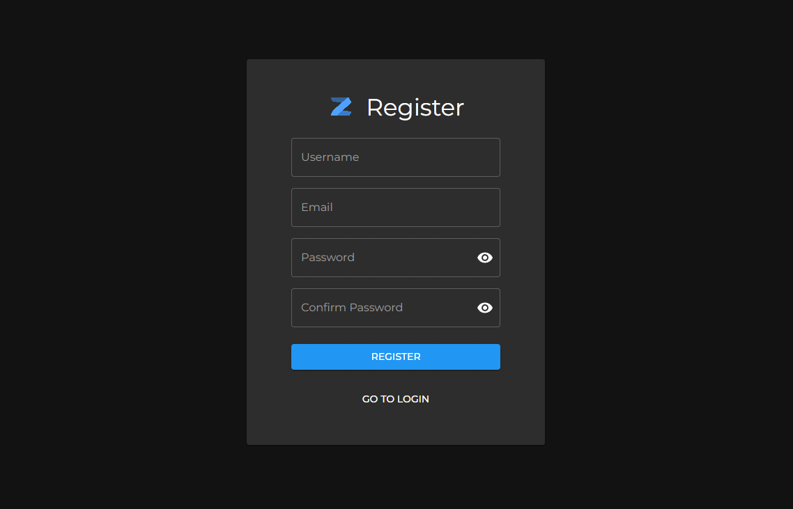
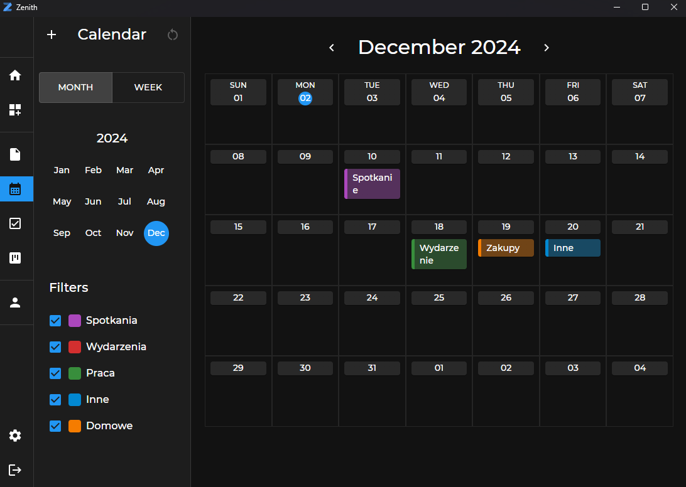
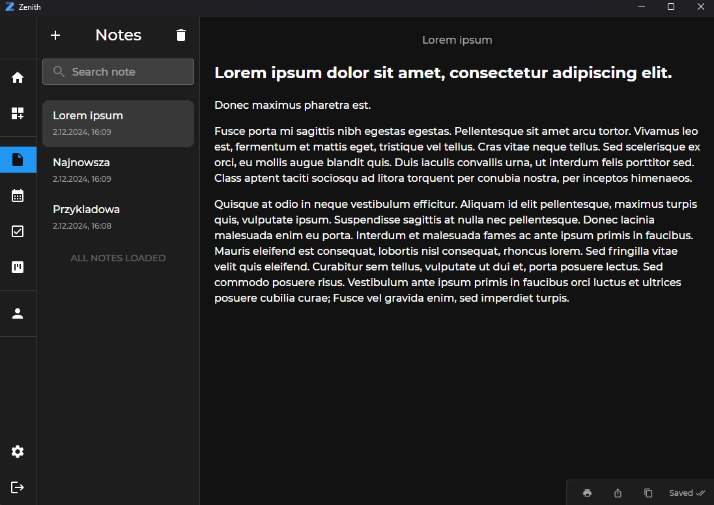
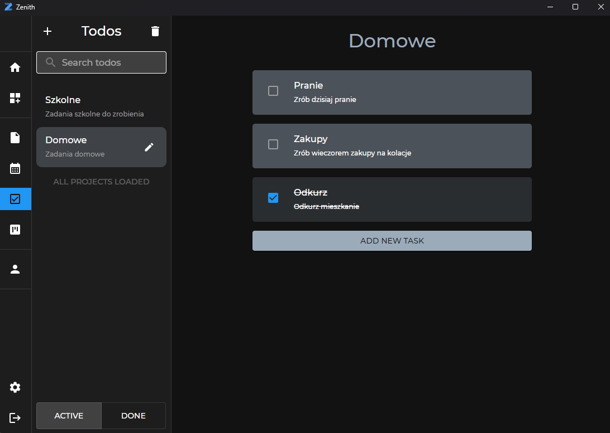
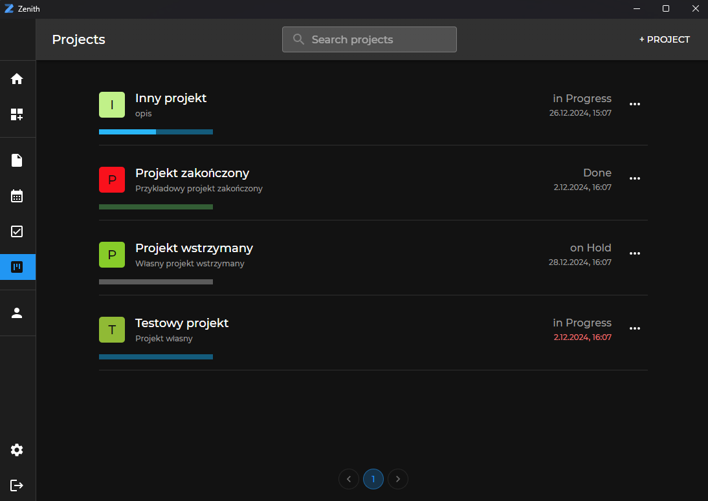
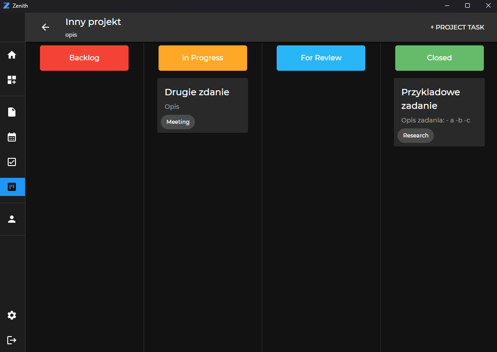
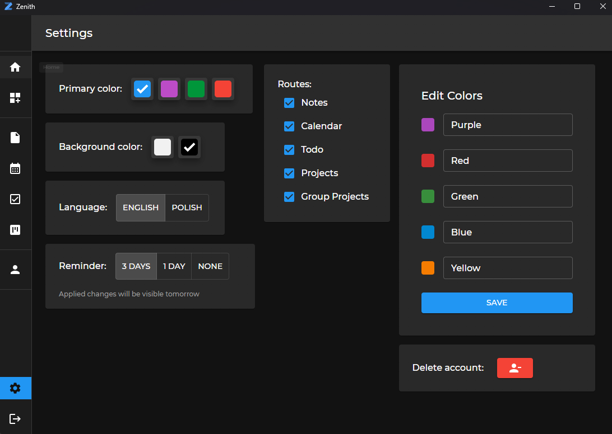

# Zenith

## Introduction

Zenith is your ultimate productivity management app. Whether you're looking to organize tasks, collaborate on projects, or keep track of important dates, Zenith has got you covered.

## Key Features

- **User Accounts:** Register, log in, and reset your password to secure your personal productivity data.
- **Email Activation:** Sign up with Zenith's email verification for a spam-free experience.
- **Home:** Get an overview of your notifications and stay updated on your activities.
- **Notes:** Write markdown notes, share them with other users, and print them to PDF or directly to a printer.
- **Calendar:** Add events, filter them, and manage your schedule efficiently.
- **To-Do Lists:** Keep track of tasks with separate views for completed and undone ones.
- **Projects:** Create projects with Kanban boards, track progress, and manage tasks.
- **Group Support:** Collaborate on projects with role-based privileges, such as admin, moderator, and user.
- **Settings:** Customize your app experience with various options:
  - Choose from four main colors: blue, red, green, and purple.
  - Toggle between black and white background themes.
  - Switch between Polish and English languages.
  - Manage notifications for calendar events and project activities.
  - Set reminders for 3 days before, 1 day before, or none.
  - Customize sidebar routes.
  - Editable calendar categories.
- **Account Management:** Easily delete and update your account if needed.

## Project Structure

```bash
project-root/
│
├── frontend/ # Frontend
│ ├── src/ # React source code
│ ├── src-tauri/ # Tauri (rust) source code
│ ├── .env.example # Example environment file
│ └── ...
│
├── backend/ # .NET Backend
│ ├── src/ # Source code
│ ├── Dockerfile # Dockerfile for the .NET backend
│ ├── docker-compose.yml # Docker Compose configuration for backend and database
│ ├── .env.example # Example environment file
│ └── ...
│
├── README.md # This file
└── ...
```

## Running the Project

### Frontend (Tauri / React)

1. Navigate to the `frontend/` directory.
2. Open a terminal.
3. Run `pnpm install` to install dependencies.
4. To run the desktop application, execute `pnpm tauri dev`
5. To run the web version, execute `pnpm run dev`

### Backend (.NET)

You can run the backend in two ways:

#### 1. Using Docker (Recommended)

To run the backend and the database using Docker, follow these steps:

- Navigate to the `backend/` directory:
  cd backend
- Ensure Docker is installed and running on your system.
- Run `docker-compose` to bring up both the backend and the database:
  docker-compose up --build
- The backend will be available at `http://localhost:5000`, and the SQL Server database will be available at `localhost:1433`.

> Note: Make sure to configure your environment variables (e.g., database connection strings) by copying `.env.example` to `.env` and updating the values as necessary.

#### 2. Without Docker (Traditional Setup)

If you prefer to run the backend locally without Docker, follow these steps:

- Ensure you have **MS SQL Server** installed and running.
- Navigate to the `backend/` directory:
  cd backend
- Open a terminal and run `dotnet restore` to install the dependencies:
  dotnet restore
- Update the database by running:
  dotnet ef database update
- Start the application:
  dotnet run

The backend will be available at `https://localhost:7086`.

## Design & Logo


_Thumbnail_

Zenith offers a clean and modern interface to help you stay productive. Here's a visual guide to some of the core features and views within the app:

### 1. Register & Log In

Start by creating your account or logging in to your existing one to access your productivity hub.

  
_Registration & Login Screen_

### 2. Calendar

Keep track of important events and deadlines with a clean and interactive calendar view.

  
_Calendar View_

### 3. Notes

Write and manage your notes using markdown. Share them with collaborators and export as PDF or print directly.

  
_Notes Editor_

### 4. To-Do Lists

Manage tasks with ease. Quickly view what’s done and what’s still pending.

  
_To-Do List View_

### 5. Projects

Organize your work into projects. Use Kanban boards to track progress and structure your tasks efficiently.

  
_Project Overview_

### 6. Project Tasks

Dive deeper into individual project boards to manage tasks with precision.

  
_Project Task View_

### 7. Settings

Customize your app experience: themes, languages, notifications, colors, and more.

  
_Settings Panel_

## Getting Started

1. **Sign Up or Log In:** Register a new account or log in with your existing credentials.
2. **Home View:** Get a quick overview of your notifications.
3. **Notes View:** Write markdown notes, share them, and print them as needed.
4. **Calendar:** Organize your schedule by adding and filtering events.
5. **To-Do Lists:** Track your tasks and organize them into done and undone.
6. **Projects:** Create and manage projects with Kanban boards. Track progress and collaborate with team members.
7. **Group Support:** Manage project roles and collaborate with multiple users.
8. **Settings:** Customize your experience by choosing colors, themes, languages, and notification preferences.
